# System Architecture

## Table of Contents

- [Overview](#overview)
- [Design Principles](#design-principles)
- [High-Level Architecture](#high-level-architecture)
- [Core Components](#core-components)
- [Agent-Audit-Resolve Pattern](#agent-audit-resolve-pattern)
- [Thought Pipe Architecture](#thought-pipe-architecture)
- [Context Compression Mechanism](#context-compression-mechanism)
- [Data Flow](#data-flow)
- [Component Interactions](#component-interactions)
- [Deployment Architecture](#deployment-architecture)
- [Technology Stack](#technology-stack)

---

## Overview

The Safety Research System is a multi-agent orchestration platform designed for pharmaceutical safety assessment. It implements a novel **Agent-Audit-Resolve** pattern that ensures quality while preventing orchestrator context overload through intelligent compression.

### Key Innovations

1. **Thought Pipes**: Replace rigid hard-coded logic with LLM-powered reasoning
2. **Agent-Audit-Resolve Loop**: Autonomous quality enforcement with automatic retry
3. **Context Compression**: Prevent orchestrator overload with 80-95% compression ratios
4. **Hybrid Audit System**: Combine hard-coded safety checks with semantic LLM analysis
5. **Intelligent Routing**: LLM-driven agent selection based on task characteristics

---

## Design Principles

### 1. Separation of Concerns

```
Orchestrator: Case decomposition and synthesis
  ↓
Task Executor: Worker agent selection and execution
  ↓
Audit Engine: Quality validation
  ↓
Resolution Engine: Retry loop management
  ↓
Context Compressor: Result compression
```

Each component has a single, well-defined responsibility.

### 2. Quality by Design

- Every task output is audited before acceptance
- Failed audits trigger automatic retry with corrections
- Critical issues escalate to human review
- CLAUDE.md anti-fabrication protocols enforced at multiple layers

### 3. Context Management

- Orchestrator receives only compressed summaries (2-3 sentences)
- Full worker outputs never reach the orchestrator
- 80-95% compression ratios prevent token limit issues
- Drill-down capability preserved via metadata references

### 4. Intelligent Automation

- LLM-driven routing selects best agent for each task
- LLM-based resolution decisions adapt to nuanced scenarios
- LLM-powered compression preserves critical information
- Hard-coded safety checks cannot be overridden

### 5. Resilience and Recovery

- Automatic retry on recoverable failures
- Graceful degradation when components fail
- Human-in-the-loop escalation for critical issues
- Comprehensive audit trails for debugging

---

## High-Level Architecture

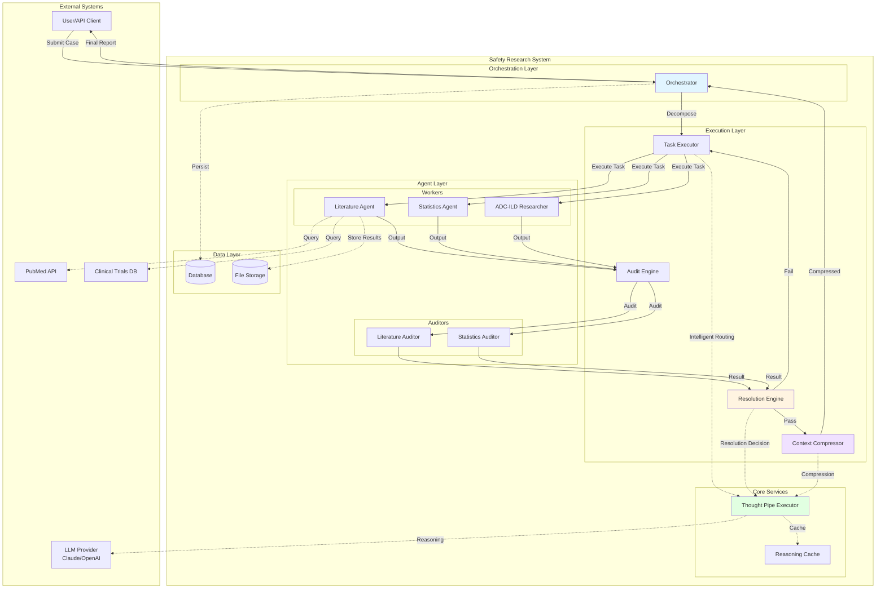

---

## Core Components

### 1. Orchestrator

**File**: `/agents/orchestrator.py`

**Responsibilities**:
- Receive safety cases from users/API
- Decompose cases into tasks
- Route tasks to Resolution Engine
- Receive compressed summaries only
- Synthesize final reports
- Manage case lifecycle

**Key Methods**:
```python
process_case(case: Case) -> Dict[str, Any]
  ↓
_decompose_case(case: Case) -> List[Task]
  ↓
_execute_task_with_validation(case: Case, task: Task)
  ↓
_synthesize_final_report(case: Case) -> Dict[str, Any]
```

**Context Protection**:
- Never sees full worker outputs
- Only receives compressed summaries (2-3 sentences)
- Compression prevents token limit issues at scale

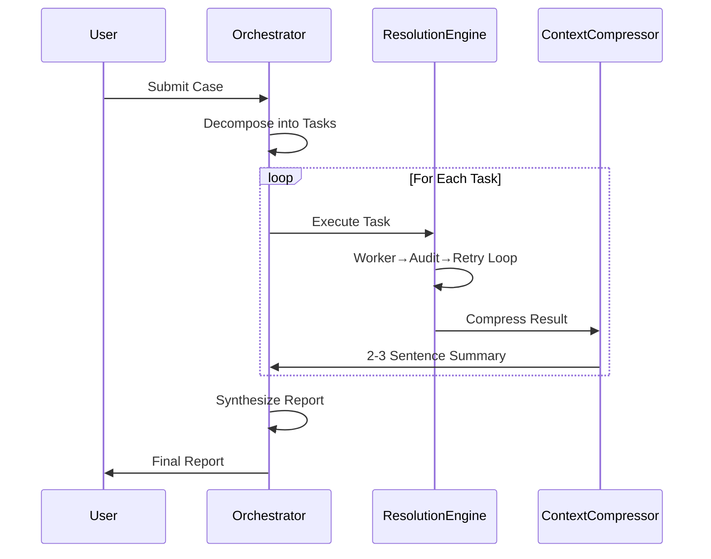

---

### 2. Task Executor

**File**: `/core/task_executor.py`

**Responsibilities**:
- Register worker agents
- Route tasks to appropriate workers
- Intelligent LLM-based agent selection (optional)
- Manage task execution lifecycle
- Handle timeouts and errors

**Routing Modes**:

**Hard-Coded Routing** (Traditional):
```python
if task.task_type == TaskType.LITERATURE_REVIEW:
    agent = worker_registry[TaskType.LITERATURE_REVIEW]
```

**Intelligent Routing** (Thought Pipe):
```python
# LLM analyzes task + case context + available agents
agent = _intelligent_route_task(task, case_context)
# Returns best agent based on:
# - Task requirements
# - Agent specialization
# - Case characteristics
```

**Benefits of Intelligent Routing**:
- Specialized agents selected for domain-specific questions
- Adapts to new scenarios without code changes
- Considers case priority and urgency
- Provides reasoning transparency

---

### 3. Audit Engine

**File**: `/core/audit_engine.py`

**Responsibilities**:
- Register auditor agents
- Route task outputs for validation
- Enforce quality standards
- Return structured audit results

**Audit Flow**:
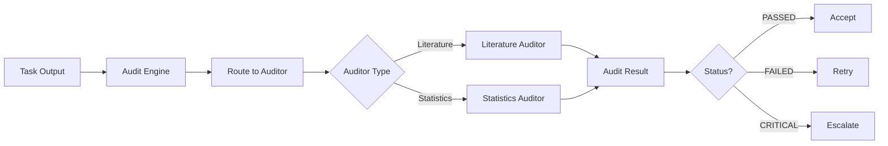

---

### 4. Resolution Engine

**File**: `/core/resolution_engine.py`

**Responsibilities**:
- Manage the Task→Audit→Retry loop
- Make retry/escalate/accept decisions
- Prepare correction instructions
- Track resolution history
- Prevent orchestrator from managing retries

**Resolution Loop**:

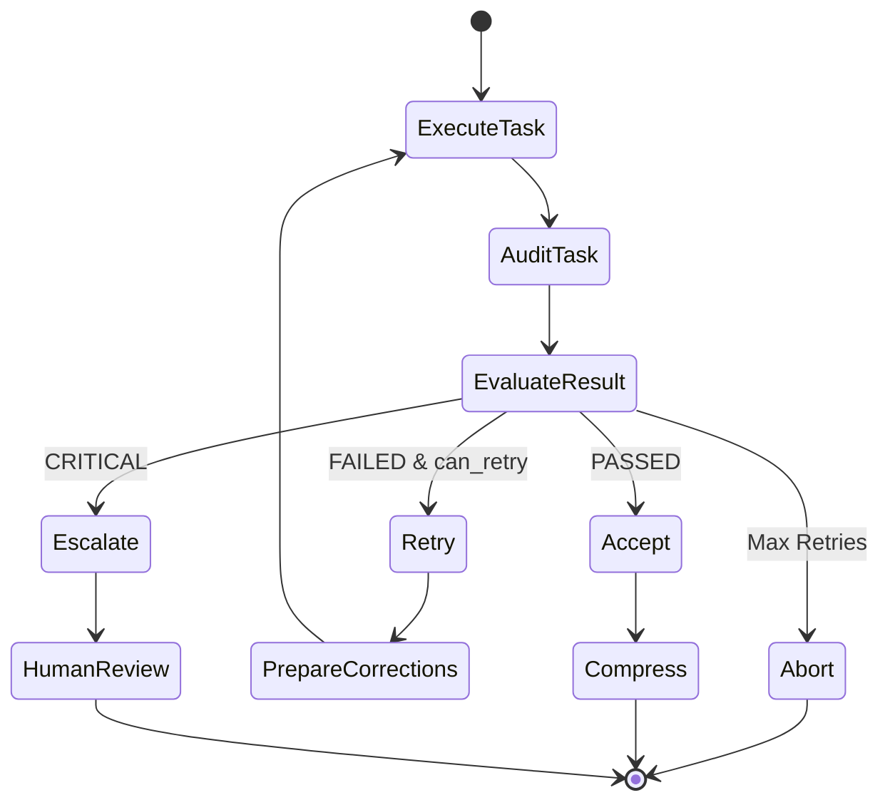

**Decision Modes**:

**Hard-Coded** (Fast, Deterministic):
```python
if audit_result.status == PASSED:
    return ACCEPT
elif audit_result.has_critical_issues():
    return ESCALATE
elif task.can_retry():
    return RETRY
else:
    return ABORT
```

**Intelligent** (Adaptive, Context-Aware):
```python
# LLM analyzes:
# - Issue fixability
# - Case priority
# - Retry value
# - Partial acceptance feasibility
decision = thought_pipe.execute(
    prompt="resolution_decision",
    context={
        "audit_result": audit_result,
        "task": task,
        "case_priority": case.priority
    }
)
# Returns: ACCEPT, RETRY, ESCALATE, or ABORT with reasoning
```

---

### 5. Context Compressor

**File**: `/core/context_compressor.py`

**Responsibilities**:
- Compress task outputs to minimal summaries
- Extract only key findings
- Preserve critical numerical claims
- Maintain drill-down capability
- Prevent orchestrator overload

**Compression Modes**:

**Legacy** (Template-Based):
```python
summary = f"{task_type} completed. {key_finding[:200]}. Validation {audit_status}."
# Simple truncation, mechanical
```

**Intelligent** (LLM-Powered):
```python
# LLM preserves:
# - Quantitative findings with exact values
# - Mechanistic insights
# - Critical limitations
# - Confidence levels
# - Cross-task connections

compressed = thought_pipe.compress(
    task_output=full_output,
    max_length=500,
    preserve_fields=["quantitative", "confidence", "limitations"]
)
# Adaptive compression based on importance
```

**Compression Metrics**:
```python
{
    "original_size": 15000,  # bytes
    "compressed_size": 2250,  # bytes
    "compression_ratio": 85.0,  # percent
    "key_findings_preserved": 5,
    "numerical_claims_preserved": 8
}
```

---

## Agent-Audit-Resolve Pattern

The core innovation that prevents context overload while ensuring quality.

### Traditional Approach (Problematic)

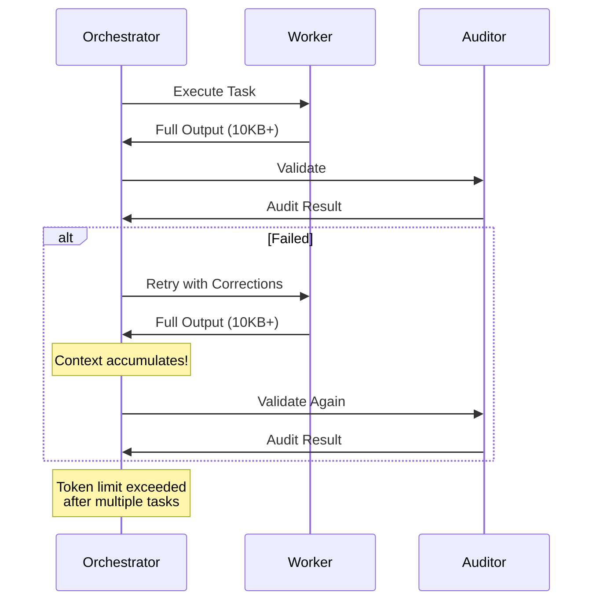

**Problems**:
- Orchestrator context grows with each retry
- Full outputs accumulate across tasks
- Token limits exceeded at scale
- No separation of concerns

### Agent-Audit-Resolve Approach (Solution)

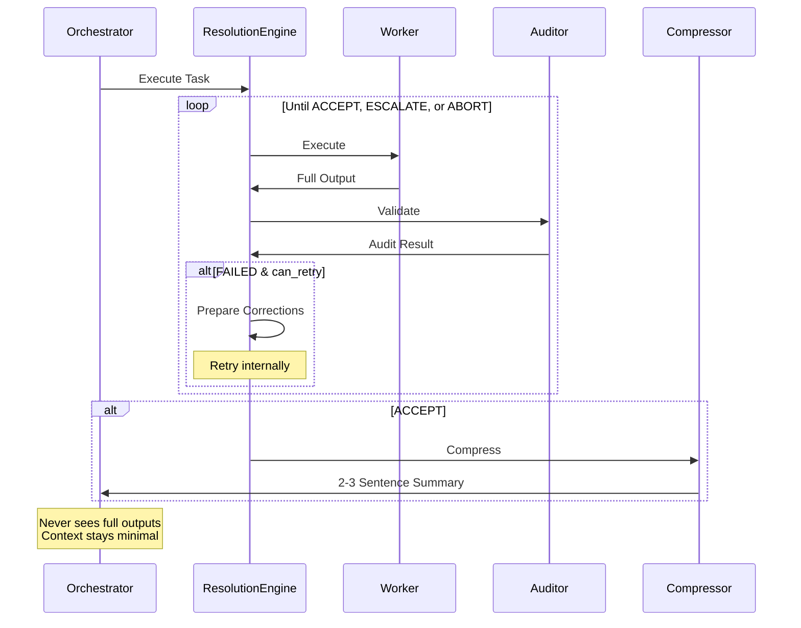

**Benefits**:
- Orchestrator context stays constant
- Retry loop isolated in Resolution Engine
- Compression before propagation
- 80-95% token reduction
- Scales to hundreds of tasks

---

## Thought Pipe Architecture

Replace rigid hard-coded logic with intelligent LLM-powered reasoning.

### Concept

A **Thought Pipe** is a structured reasoning task that transforms:

**From**:
```python
# Hard-coded conditional logic
if case.priority == "HIGH" and case.type == "adverse_event":
    if case.data_quality < 0.7:
        return "request_more_data"
    elif case.complexity > 0.8:
        return "assign_to_expert"
    else:
        return "assign_to_standard_agent"
# Endless if/else chains
```

**To**:
```python
# LLM-powered reasoning
decision = thought_pipe_executor.execute_thought_pipe(
    prompt="route_case",
    context=case.to_dict(),
    validation_fn=validate_routing_response
)
# Returns intelligent routing based on nuanced analysis
```

### Thought Pipe Components

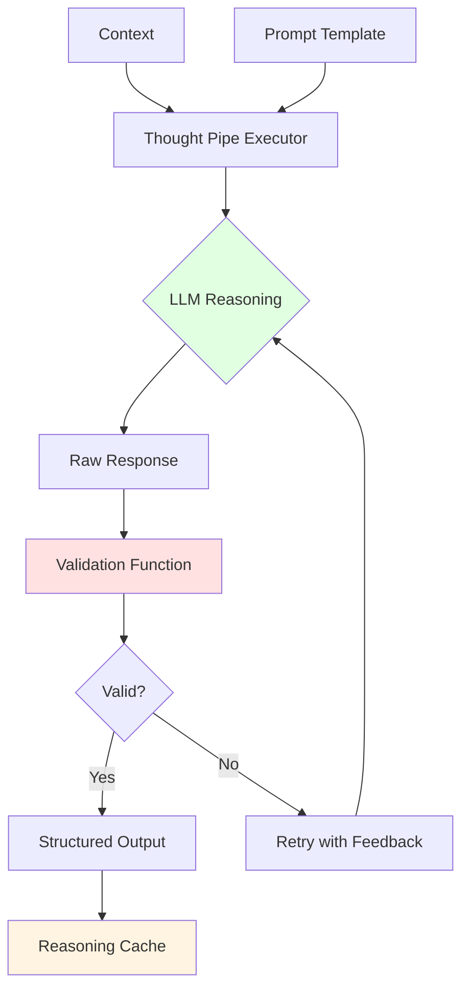

### Thought Pipe Use Cases

#### 1. Intelligent Task Routing

**Context**:
```json
{
  "task": {
    "task_type": "literature_review",
    "query": "What is the mechanism of T-DXd pneumonitis?"
  },
  "case": {
    "question": "ADC-associated ILD mechanisms",
    "priority": "HIGH"
  },
  "available_agents": [
    {
      "agent_class": "LiteratureAgent",
      "capabilities": "General literature review"
    },
    {
      "agent_class": "ADC_ILD_Researcher",
      "capabilities": "Specialized ADC/ILD domain expertise"
    }
  ]
}
```

**LLM Reasoning**:
```
The task query "mechanism of T-DXd pneumonitis" and case question
"ADC-associated ILD mechanisms" clearly fall within the specialized
domain of ADC-ILD research. The ADC_ILD_Researcher agent has domain
expertise that would provide more relevant mechanistic insights than
a general literature agent.

Decision: Select ADC_ILD_Researcher
Confidence: High
Reasoning: Specialized domain match
```

#### 2. Intelligent Resolution Decisions

**Context**:
```json
{
  "audit_result": {
    "status": "failed",
    "issues": [
      {
        "category": "missing_confidence_interval",
        "severity": "warning",
        "fixable": true
      },
      {
        "category": "small_sample_size",
        "severity": "info",
        "fixable": false
      }
    ]
  },
  "task": {
    "retry_count": 0,
    "max_retries": 2
  },
  "case_priority": "HIGH"
}
```

**LLM Reasoning**:
```
Issue 1 (missing CI) is fixable - worker can add confidence intervals.
Issue 2 (small sample size) is NOT fixable - data limitation, not worker error.

For HIGH priority case, we should:
1. RETRY to fix the fixable issue (missing CI)
2. ACCEPT with documented caveat about sample size

Decision: RETRY
Priority Fixes: ["Add confidence intervals to all quantitative claims"]
Guidance: "Small sample size is a known limitation - document but don't reject"
```

#### 3. Intelligent Compression

**Context**:
```json
{
  "task_output": {
    "summary": "Literature review of 45 studies...",
    "findings": {
      "incidence": "10-15% (95% CI: 8.2-17.3%)",
      "risk_factors": ["baseline ILD", "age >65", "smoking"],
      "mechanism": "Immune-mediated damage to alveolar epithelium..."
    }
  },
  "case_question": "What are risk factors for T-DXd pneumonitis?",
  "max_length": 500
}
```

**LLM Compression**:
```
Case question focuses on RISK FACTORS, so prioritize:
1. Quantitative incidence (exact values preserved)
2. List of risk factors (directly answers question)
3. Mechanism (less relevant to question, can summarize briefly)

Compressed (348 chars):
"Review of 45 studies found T-DXd pneumonitis incidence of 10-15%
(95% CI: 8.2-17.3%). Primary risk factors: baseline ILD, age >65,
smoking history. Mechanism involves immune-mediated alveolar epithelial
damage. Moderate confidence due to study heterogeneity (I²=45%)."
```

### Thought Pipe Safety

**Hard-Coded Safety Overrides**:

Certain decisions CANNOT be overridden by LLM reasoning:

```python
# SAFETY CHECK: Fabrication detection
if has_fabricated_data(output):
    return ESCALATE  # LLM cannot override

# SAFETY CHECK: Max retries
if task.retry_count >= max_retries:
    return ABORT  # LLM cannot override

# SAFETY CHECK: Critical audit failure
if audit_result.has_critical_issues():
    # Check if it's a fabrication violation
    if is_fabrication_violation(audit_result):
        return ESCALATE  # LLM cannot override
```

**Validation Functions**:

Every thought pipe has a validation function that checks:
- Response format is correct
- Required fields present
- Values are valid (e.g., agent exists)
- Reasoning is substantive (not generic)

```python
def validate_routing_response(response: Dict, context: Dict) -> bool:
    if "selected_agent_class" not in response:
        return False

    # Selected agent must exist
    if response["selected_agent_class"] not in context["available_agents"]:
        return False

    # Reasoning must be substantive
    if len(response.get("reasoning", "")) < 50:
        return False

    return True
```

### Reasoning Cache

To prevent redundant LLM calls:

```python
# Cache key based on prompt + context hash
cache_key = (prompt_name, hash(context))

# Check cache
cached = reasoning_cache.get(cache_key)
if cached:
    return cached

# Execute LLM reasoning
result = llm.execute(prompt, context)

# Cache result
reasoning_cache.set(cache_key, result)
```

---

## Context Compression Mechanism

How we achieve 80-95% compression while preserving critical information.

### Compression Strategy

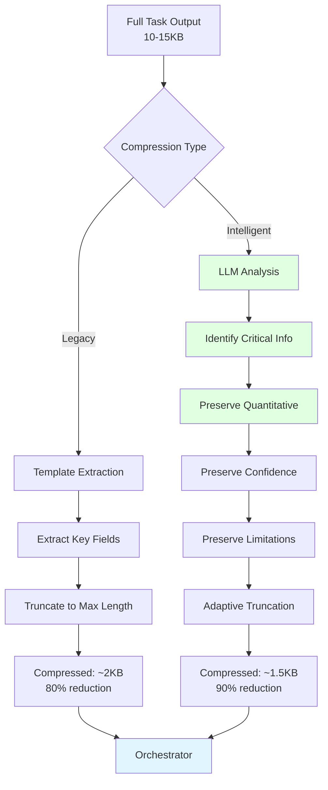

### What Gets Preserved

**Always Preserved**:
- Exact quantitative claims (no rounding)
- Confidence levels (no inflation)
- Critical limitations
- Audit status (if issues found)

**Compressed**:
- Verbose methodology descriptions
- Redundant explanations
- Intermediate calculations
- Detailed source lists (kept as count)

**Removed**:
- Boilerplate text
- Duplicated information
- Non-critical metadata

### Example Compression

**Original** (1,847 characters):
```
The literature review identified 45 relevant studies examining the
relationship between trastuzumab deruxtecan (T-DXd) and interstitial
lung disease (ILD). Of these, 23 were randomized controlled trials,
15 were cohort studies, and 7 were case reports. The meta-analysis
showed a pooled incidence rate of 12.3% (95% CI: 10.1-14.8%, p<0.001)
for any-grade ILD in patients receiving T-DXd. Grade 3+ ILD occurred
in 2.8% (95% CI: 1.9-4.1%) of patients. Significant heterogeneity
was observed (I²=45%), suggesting variability in study populations
and methodologies.

Primary risk factors identified include: baseline interstitial lung
abnormalities (OR: 3.2, 95% CI: 2.1-4.9), age over 65 years
(OR: 1.8, 95% CI: 1.2-2.7), and smoking history (OR: 1.6, 95% CI:
1.1-2.3). The mechanistic understanding indicates immune-mediated
damage to alveolar epithelial cells, with lymphocytic infiltration
observed in biopsy samples.

Key limitations include: most studies excluded patients with baseline
ILD, follow-up duration varied widely (3-24 months), mechanistic
studies were limited (only 5 of 45 studies), publication bias cannot
be ruled out (funnel plot asymmetry detected), and real-world data
is sparse compared to clinical trial data...
```

**Compressed - Intelligent** (412 characters):
```
Meta-analysis of 45 studies: T-DXd ILD incidence 12.3% (95% CI:
10.1-14.8%), Grade 3+ in 2.8% (1.9-4.1%). Risk factors: baseline
lung abnormalities (OR:3.2), age >65 (OR:1.8), smoking (OR:1.6).
Mechanism: immune-mediated alveolar damage with lymphocytic
infiltration. Moderate confidence due to heterogeneity (I²=45%) and
exclusion of baseline ILD patients in trials. Limited mechanistic
studies (5/45).
```

**Compression Ratio**: 77.7% reduction

**What's Preserved**:
- Exact incidence rates with CIs
- Exact odds ratios for risk factors
- Mechanistic insight
- Confidence caveats
- Critical limitations

**What's Removed**:
- Study type breakdown (RCT vs cohort)
- Verbose methodology descriptions
- Redundant explanations
- Intermediate details

---

## Data Flow

### Case Processing Flow

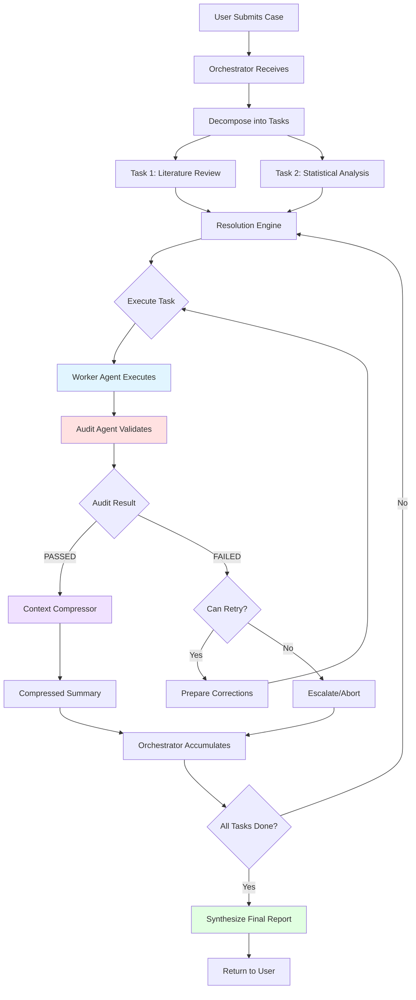

### Task Execution Flow

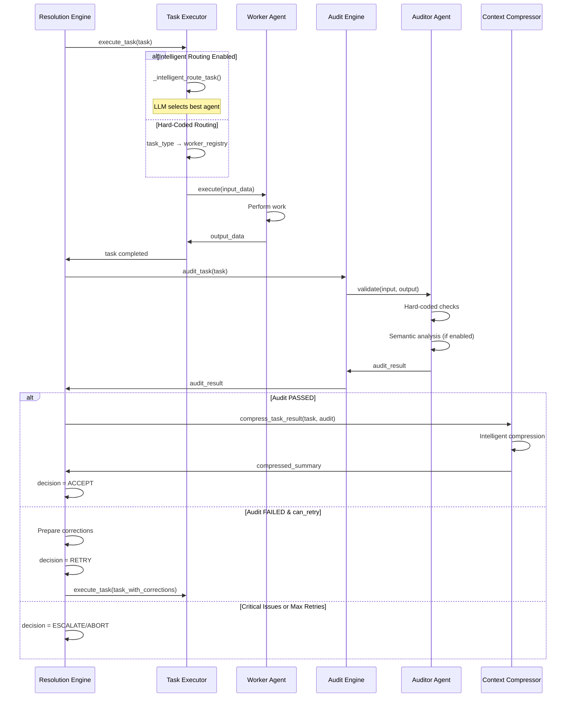

---

## Component Interactions

### Orchestrator → Resolution Engine

```python
# Orchestrator delegates task execution
def _execute_task_with_validation(self, case: Case, task: Task):
    # Resolution engine handles ENTIRE validation loop
    decision, audit_result = self.resolution_engine.execute_with_validation(task)

    # Compress result (orchestrator never sees full output)
    compressed = self.context_compressor.compress_task_result(task, audit_result)

    # Store only compressed summary
    self.task_summaries[case.case_id][task.task_id] = compressed
```

**Key Point**: Orchestrator is completely shielded from retry logic.

### Resolution Engine → Task Executor → Worker

```python
# Resolution Engine manages retry loop
def execute_with_validation(self, task: Task):
    while True:
        # Execute task
        self.task_executor.execute_task(task)

        # Audit result
        audit_result = self.audit_engine.audit_task(task)

        # Evaluate
        decision = self._evaluate_audit_result(task, audit_result)

        if decision == ACCEPT:
            return decision, audit_result
        elif decision == RETRY:
            # Prepare corrections and continue loop
            corrections = self._prepare_corrections(audit_result)
            task.input_data["corrections"] = corrections
            task.increment_retry()
            continue  # Loop continues internally
        else:
            return decision, audit_result  # ESCALATE or ABORT
```

### Audit Engine → Auditor Agents

```python
# Hybrid audit approach
def audit_task(self, task: Task) -> AuditResult:
    # Get appropriate auditor
    auditor = self.auditor_registry[task.task_type]

    # Auditor runs validation
    result = auditor.validate(
        task_input=task.input_data,
        task_output=task.output_data,
        task_metadata=task.metadata
    )

    # Auditor internally runs:
    # 1. Hard-coded safety checks (always)
    # 2. Semantic LLM analysis (if enabled)

    return AuditResult.from_dict(result)
```

### Thought Pipe Executor → LLM

```python
def execute_thought_pipe(self, prompt, context, validation_fn):
    # Build full prompt with context
    full_prompt = prompt.format(**context)

    # Call LLM
    response = self.llm_client.generate(
        prompt=full_prompt,
        temperature=0.0,  # Deterministic for reasoning
        max_tokens=2000
    )

    # Parse response
    parsed = json.loads(response)

    # Validate
    if not validation_fn(parsed, context):
        # Retry with feedback
        return self.execute_thought_pipe(...)

    return parsed
```

---

## Deployment Architecture

### Development Environment

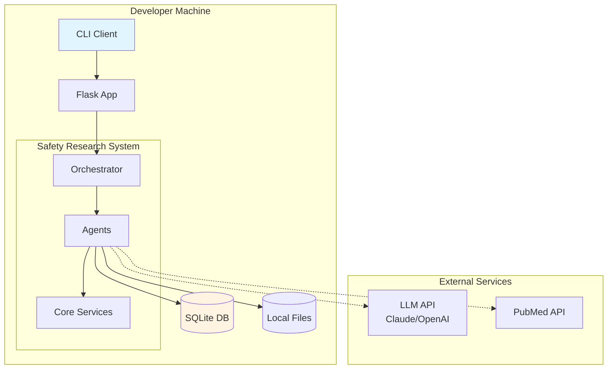

### Production Environment

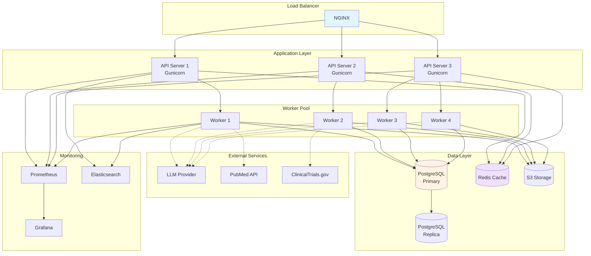

---

## Technology Stack

### Core Technologies

| Layer | Technology | Purpose |
|-------|-----------|---------|
| **Language** | Python 3.8+ | Primary development language |
| **LLM** | Claude 3.5 Sonnet / GPT-4 | Reasoning engine for thought pipes |
| **Framework** | Flask/FastAPI | REST API (production) |
| **Database** | PostgreSQL | Case and task persistence |
| **Cache** | Redis | Reasoning cache, session storage |
| **Storage** | S3 / Local FS | Document and output storage |
| **Queue** | Celery + RabbitMQ | Async task processing (optional) |

### Libraries

| Library | Version | Purpose |
|---------|---------|---------|
| `requests` | 2.31+ | HTTP requests, API integration |
| `anthropic` | 0.7+ | Claude API client |
| `openai` | 1.0+ | OpenAI API client (optional) |
| `sqlalchemy` | 2.0+ | Database ORM |
| `pytest` | 7.4+ | Testing framework |
| `black` | 23.7+ | Code formatting |
| `mypy` | 1.5+ | Type checking |

### Infrastructure

| Component | Technology | Purpose |
|-----------|-----------|---------|
| **Web Server** | Gunicorn / Uvicorn | WSGI/ASGI server |
| **Reverse Proxy** | NGINX | Load balancing, SSL |
| **Container** | Docker | Application packaging |
| **Orchestration** | Kubernetes | Container orchestration |
| **Monitoring** | Prometheus + Grafana | Metrics and dashboards |
| **Logging** | ELK Stack | Centralized logging |
| **CI/CD** | GitHub Actions | Automated testing, deployment |

---

## Scalability Considerations

### Horizontal Scaling

**API Layer**:
- Stateless API servers
- Load balancer distributes requests
- Auto-scaling based on CPU/memory

**Worker Pool**:
- Parallel task execution
- Worker instances scale independently
- Queue-based task distribution

**Database**:
- Read replicas for queries
- Write-through cache (Redis)
- Sharding by case_id (if needed)

### Performance Optimization

**Reasoning Cache**:
- Cache LLM reasoning decisions
- Hit rate target: >70%
- TTL: 24 hours

**Context Compression**:
- 80-95% token reduction
- Enables processing hundreds of tasks
- Prevents orchestrator overload

**Parallel Execution**:
- Independent tasks run in parallel
- Worker pool configurable
- Task dependencies respected

---

## Security Considerations

### Authentication & Authorization

- API key authentication
- Role-based access control (RBAC)
- Case-level permissions

### Data Protection

- Encryption at rest (database)
- Encryption in transit (TLS)
- PHI/PII handling compliance

### Audit Trail

- All actions logged
- Immutable audit records
- Reasoning transparency

### LLM Safety

- Hard-coded safety checks cannot be overridden
- Fabrication detection at multiple layers
- Human-in-the-loop escalation for critical issues

---

## Maintenance & Operations

### Monitoring Metrics

**System Health**:
- API response time
- Worker utilization
- Database connection pool
- LLM API latency

**Business Metrics**:
- Cases per day
- Task completion rate
- Audit pass rate
- Average case duration

**Quality Metrics**:
- Compression ratio
- Retry rate
- Escalation rate
- False positive/negative rates

### Alerting

**Critical**:
- System down
- Database unreachable
- LLM API failure
- High error rate (>5%)

**Warning**:
- High latency (>10s)
- Low cache hit rate (<50%)
- High retry rate (>20%)
- Queue backlog

---

## Future Architecture Enhancements

### Planned Improvements

1. **GraphQL API**: More flexible queries
2. **Event Streaming**: Kafka for real-time events
3. **Multi-Model LLM**: Ensemble reasoning
4. **Federated Learning**: Privacy-preserving model training
5. **Real-Time Dashboard**: Live case monitoring

### Research Directions

1. **Active Learning**: LLM improves from corrections
2. **Meta-Reasoning**: LLM evaluates its own reasoning
3. **Explainable AI**: Enhanced transparency
4. **Human-AI Collaboration**: Seamless handoff

---

**Last Updated**: November 1, 2025

**Architecture Version**: 1.0.0
